# 📰 Newsapp Backend Service

A scalable news aggregation and delivery platform backend built with **Node.js**, **TypeScript**, and microservices architecture.

🔗 **Live API**: `https://news-api.alat.cc`  
📖 **API Documentation**: `https://news-api.alat.cc/api/docs`

## 🏗️ System Architecture

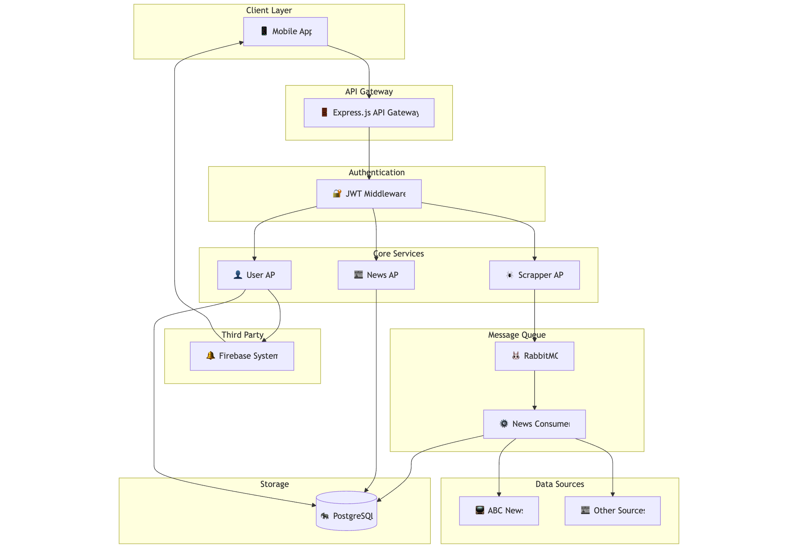

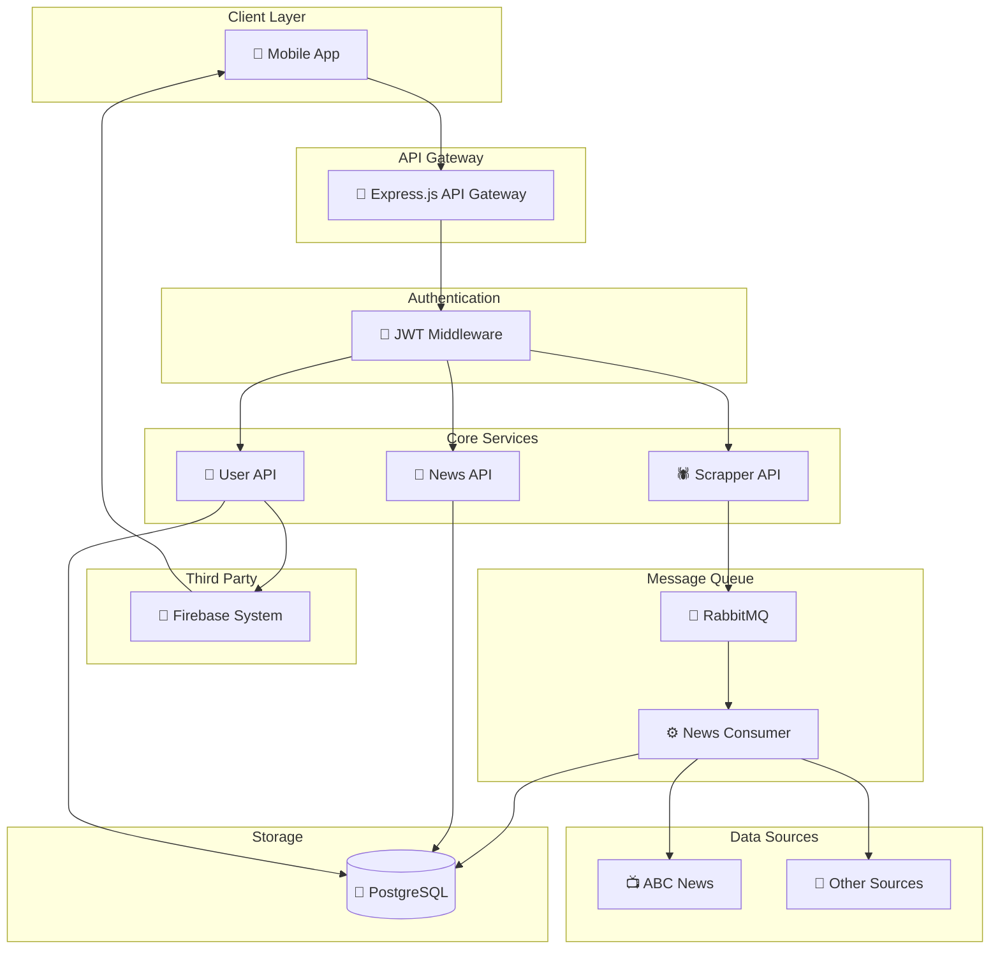

## 🎯 Key Features

### 🕷️ Web Scraping Pipeline
The system automatically crawls and scrapes news content from multiple sources:

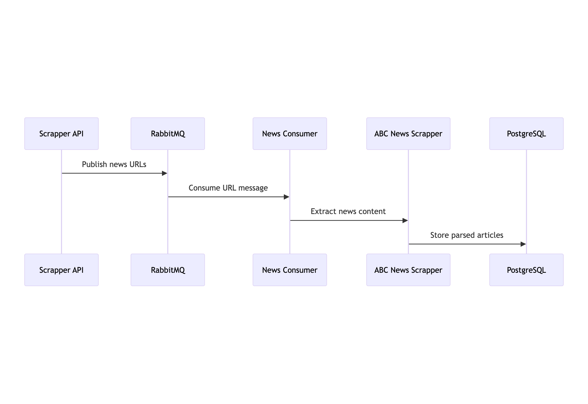

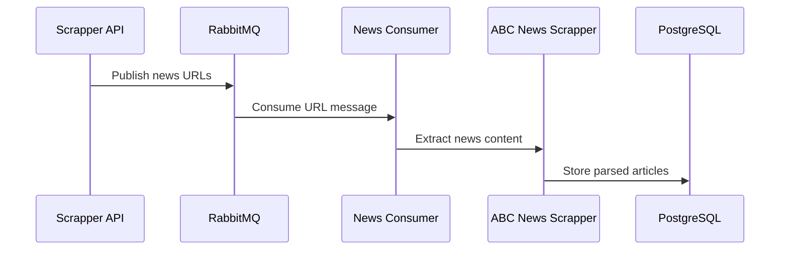

**Implementation Details:**
- **Extensible Architecture**: Each news source has its dedicated scrapper (`abcnews.scrapper.service.ts`)
- **Asynchronous Processing**: RabbitMQ decouples scraping from API responses
- **Error Resilience**: Failed scrapes are retried automatically

### 📄 Cursor-Based Pagination
Efficient infinite scroll implementation for mobile and web clients:

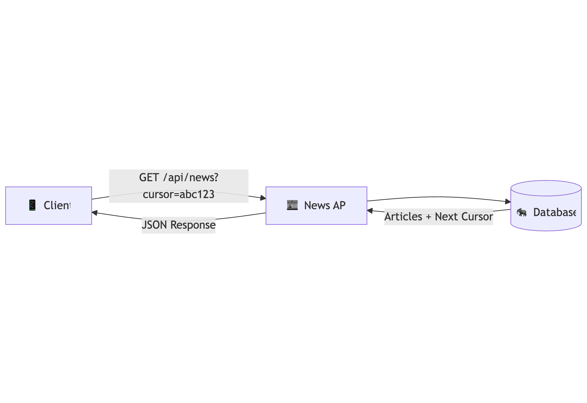

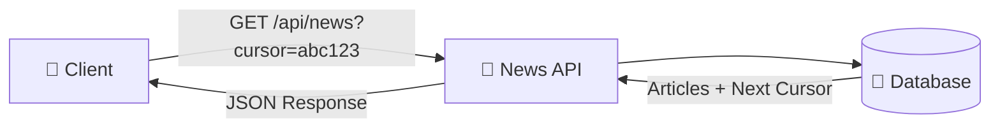

**Benefits:**
- ⚡ **Performance**: No OFFSET queries, constant-time pagination
- 📱 **Mobile Optimized**: Perfect for infinite scroll UX
- 🔄 **Real-time Updates**: New articles don't break pagination

### 🔐 Authentication & Security

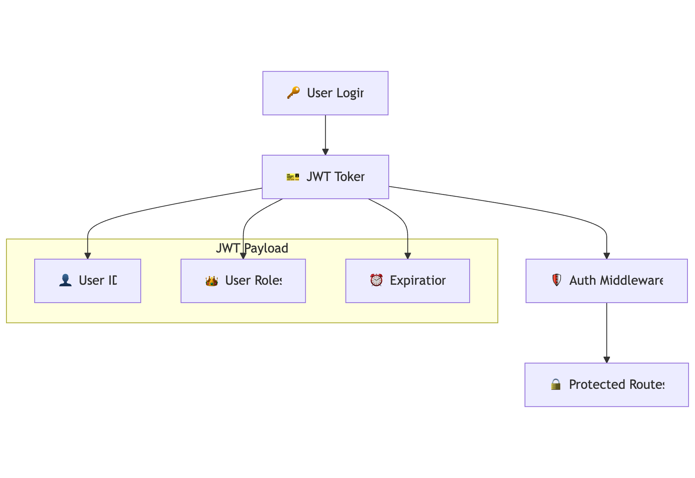

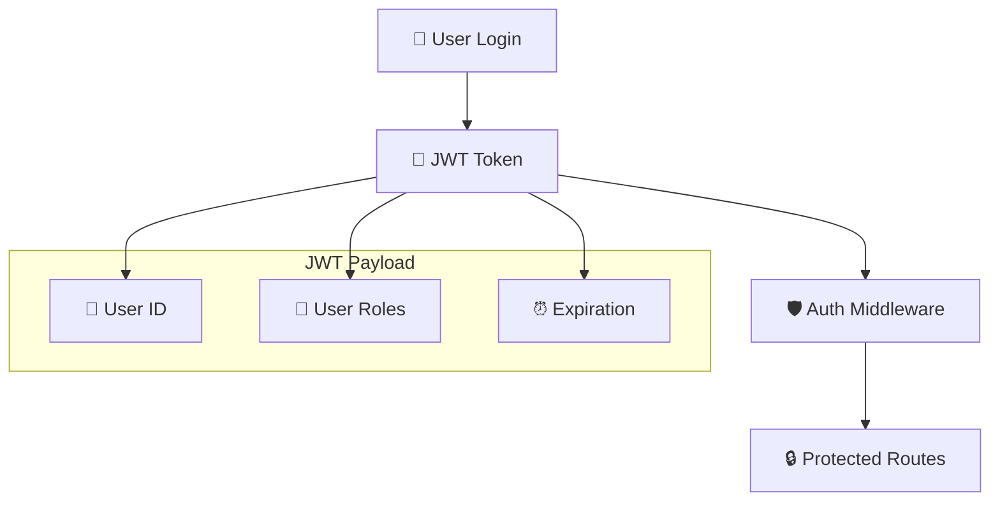

**Security Features:**
- 🎫 **JWT Authentication**: Stateless token-based auth
- 🛡️ **Route Protection**: Middleware validates tokens
- 🔒 **Secure Headers**: CORS and security headers configured

### 🔔 Push Notifications System

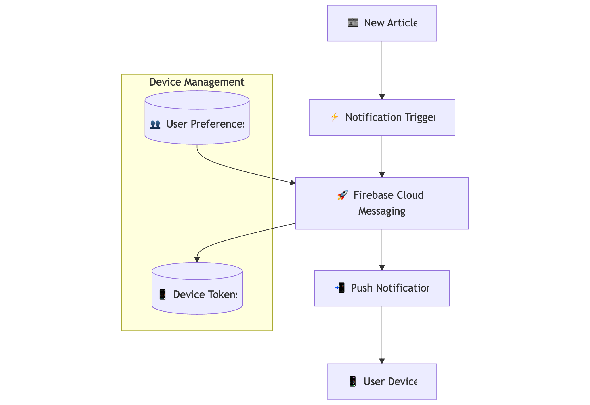

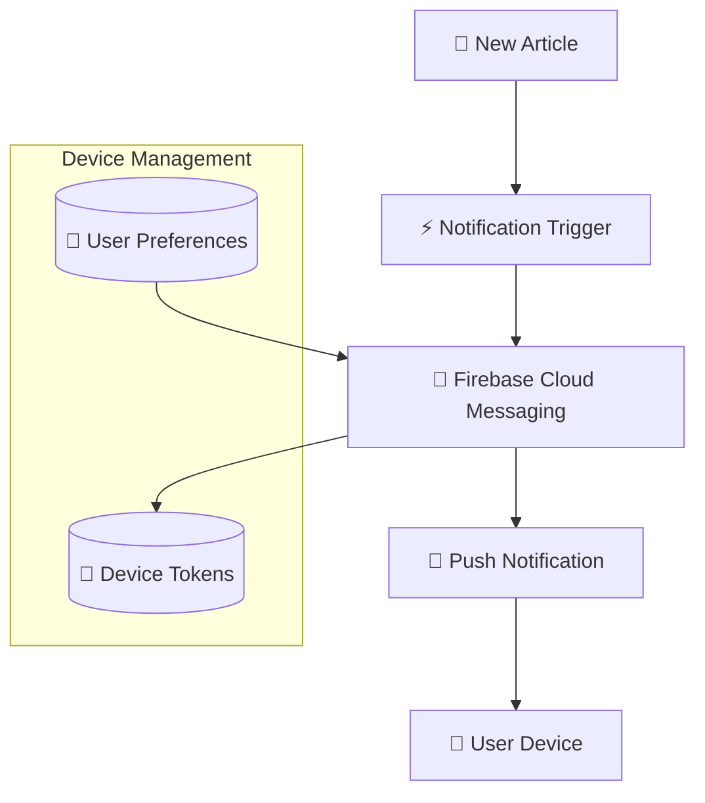

**Features:**
- 🚀 **Firebase Integration**: Reliable push delivery
- 📱 **Device Token Management**: Track user devices
- 🎛️ **User Preferences**: Configurable notification settings

## 📚 API Documentation

Interactive Swagger documentation available at: `https://news-api.alat.cc/api/docs`

### 🔗 Main Endpoints

| Endpoint | Method | Description | Auth Required |
|----------|--------|-------------|---------------|
| `/api/news` | GET | Get paginated news feed | ❌ |
| `/api/users/register` | POST | User registration | ❌ |
| `/api/users/login` | POST | User authentication | ❌ |
| `/api/users/device-token` | POST | Register device for notifications | ✅ |
| `/api/scrapper` | POST | Manually trigger news scraping | ❌ |

## 🛠️ Technology Stack

| Category | Technology | Purpose |
|----------|------------|---------|
| **Runtime** | Node.js + TypeScript | Server-side JavaScript with type safety |
| **Framework** | Express.js | Web application framework |
| **Database** | PostgreSQL + Sequelize | Relational database with ORM |
| **Message Queue** | RabbitMQ | Asynchronous job processing |
| **Authentication** | JWT + bcrypt | Token-based auth with password hashing |
| **Push Notifications** | Firebase Cloud Messaging | Mobile push notifications |
| **Documentation** | Swagger/OpenAPI | Interactive API documentation |
| **Containerization** | Docker + Docker Compose | Deployment and orchestration |

## 🚀 Deployment Architecture

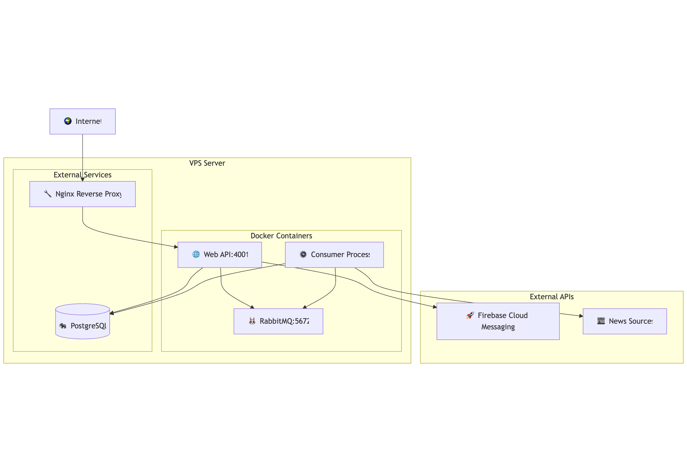

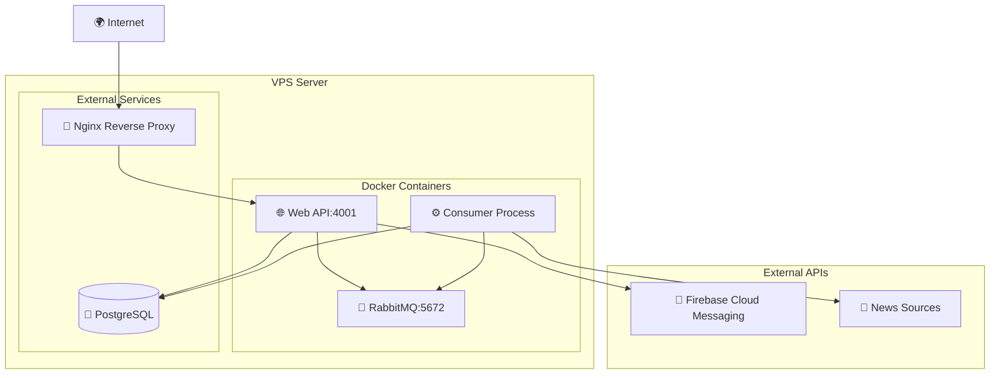

**Deployment Features:**
- 🐳 **Containerized**: Docker containers for consistency
- 🔄 **Multi-Service**: Separate containers for web and consumer
- 🌐 **Reverse Proxy**: Nginx for SSL termination and load balancing
- 📊 **Monitoring**: Process health checks and logging

## 🚀 Getting Started

### 📋 Prerequisites

- **Node.js** (v18 or higher)
- **Docker** & **Docker Compose**
- **PostgreSQL** (if running locally)
- **RabbitMQ** (if running locally)

### ⚡ Quick Start

1. **Clone the repository**
   ```bash
   git clone <repository-url>
   cd newsarc
   ```

2. **Install dependencies**
   ```bash
   npm install
   ```

3. **Environment Setup**
   ```bash
   cp .env.example .env
   # Edit .env with your configuration
   ```

4. **Start with Docker Compose** (Recommended)
   ```bash
   docker-compose up -d
   ```

5. **Run Database Migrations**
   ```bash
   npm run migrate
   ```

6. **Access the Application**
   - **API Server**: `http://localhost:4001`
   - **API Documentation**: `http://localhost:4001/api/docs`
   - **RabbitMQ Management**: `http://localhost:15672`

### 🔧 Development Mode

For development with hot reload:

```bash
# Start infrastructure services
docker-compose up -d rabbitmq

# Run API server
npm run dev

# Run consumer in separate terminal
npm run consumers
```

### 📁 Project Structure

```
newsarc/
├── src/
│   ├── app.ts                 # Express app configuration
│   ├── server.ts              # Server entry point
│   ├── config/                # Database and app configuration
│   ├── domain/                # Business logic modules
│   │   ├── news/              # News-related features
│   │   ├── user/              # User management & notifications
│   │   └── scrapper/          # Web scraping services
│   ├── infrastructure/        # External service integrations
│   │   ├── fcm.service.ts     # Firebase Cloud Messaging
│   │   ├── rabbitmq.service.ts # Message queue
│   │   └── consumers/         # Background job processors
│   ├── middleware/            # Express middleware
│   └── utils/                 # Utility functions
├── migrations/                # Database migrations
├── config/                   # Configuration files
├── credentials/              # Service account keys
├── docker-compose.yml        # Container orchestration
├── Dockerfile               # Container definition
└── package.json             # Dependencies and scripts
```

### 🔑 Environment Variables

Create a `.env` file with the following variables:

```env
# Database
DB_HOST=localhost
DB_PORT=5432
DB_NAME=newsarc
DB_USER=your_db_user
DB_PASS=your_db_password

# JWT
JWT_SECRET=your_jwt_secret_key

# RabbitMQ
RABBITMQ_URL=amqp://localhost:5672

# Firebase (for push notifications)
GOOGLE_APPLICATION_CREDENTIALS=./credentials/credential-file.json

# API Configuration
PORT=4000
NODE_ENV=development
```

## 📈 Performance & Monitoring

- **Database Indexing**: Optimized queries with proper indexes
- **Connection Pooling**: Efficient database connection management
- **Caching Strategy**: Redis integration for frequently accessed data
- **Rate Limiting**: API rate limiting to prevent abuse
- **Health Checks**: Docker health checks for service monitoring

## 🔒 Security Best Practices

- ✅ **Input Validation**: Zod schema validation for all inputs
- ✅ **SQL Injection Protection**: Sequelize ORM with parameterized queries
- ✅ **XSS Prevention**: Content sanitization and CSP headers
- ✅ **CORS Configuration**: Proper cross-origin resource sharing setup
- ✅ **JWT Security**: Secure token generation and validation
- ✅ **Environment Isolation**: Sensitive data in environment variables

## 🤝 Contributing

1. Fork the repository
2. Create your feature branch (`git checkout -b feature/amazing-feature`)
3. Commit your changes (`git commit -m 'Add some amazing feature'`)
4. Push to the branch (`git push origin feature/amazing-feature`)
5. Open a Pull Request

## 📄 License

This project is licensed under the MIT License - see the [LICENSE](LICENSE) file for details.

---

**Built with ❤️ for scalable news aggregation**
